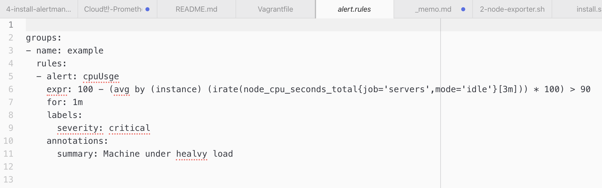

# Sol4
## 문제 4. CPU 3분 평균 사용률이 90%넘으면 자신의 Slack의 xalert이라는 체널에 표시되도록 하시오.
1. 참고할 PromQL
```
expr: 100 - (avg by (instance) (irate(node_cpu_seconds_total{job='node_exporter',mode='idle'}[5m])) * 100) > 95
    
```
2. 해당 SlackChannel에 xxx을 초대하시오.
3. prometheus.yml,alertmanager.yml,alert.rules 파일과 캡쳐 화면을 ./sol4 폴더에 저장하시오.
4. AlertManager는 s2에 설치하시오.
5. 기존 Prometheus의 셋팅은 삭제할 것.





